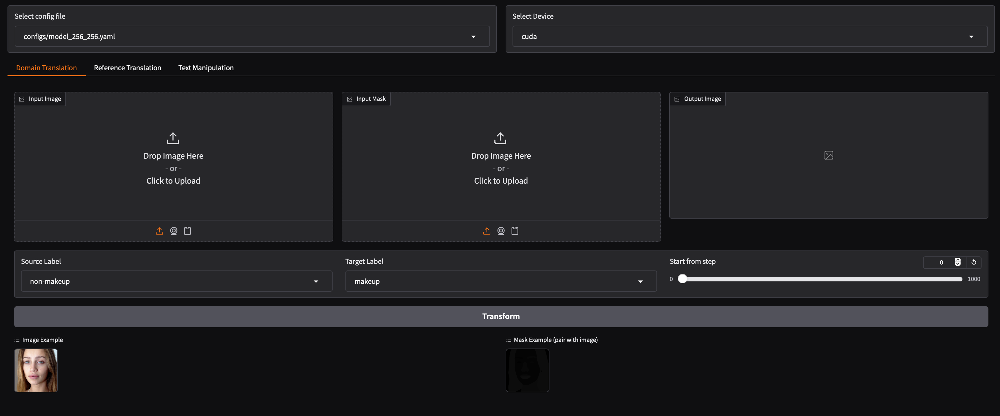

<div id="top" align="center">

<h1>MAD: Makeup All-in-One with Cross-Domain Diffusion Model</h1>

<p><strong>A unified cross-domain diffusion model for various makeup tasks</strong></p>

<a href="#license-and-citation">
  
</a><br/><br/>

<br/>

</div>

> Bo-Kai Ruan, Hong-Han Shuai
>
> * Contact: Bo-Kai Ruan

## 🚀 A. Installation

### Step 1: Create Environment

* Ubuntu 22.04 with Python ≥ 3.10 (tested with GPU using CUDA 11.8)

```shell
conda create --name mad python=3.10 -y
conda activate mad
```

### Step 2: Install Dependencies

```shell
conda install pytorch==2.0.1 torchvision==0.15.2 torchaudio==2.0.2 pytorch-cuda=11.8 -c pytorch -c nvidia -y
conda install xformers -c xformers -y
pip install -r requirements.txt

# Weights for landmarks
wget http://dlib.net/files/shape_predictor_68_face_landmarks.dat.bz2
bzip2 -d shape_predictor_68_face_landmarks.dat.bz2 && mkdir weights && mv shape_predictor_68_face_landmarks.dat weights
```

### Step 3: Prepare the Dataset

The following table provides download links for the datasets:

| Dataset            | Link                                                                                                                                                                                            |
| ------------------ | ----------------------------------------------------------------------------------------------------------------------------------------------------------------------------------------------- |
| MT Dataset         | [all](https://drive.google.com/file/d/1jP7CpiczZ9KjTQu87PEERrN7BOrxB5St/view?usp=sharing)                                                                                                       |
| BeautyFace Dataset | [images](https://drive.google.com/file/d/1mhoopmi7OlsClOuKocjldGbTYnyDzNMc/view?usp=sharing), [parsing map](https://drive.google.com/file/d/1WgadvcV1pUtEMCYxjwWBledEQfDbadn7/view?usp=sharing) |

We recommend unzipping and placing the datasets in the same folder with the following structure:

```plaintext
📦 data
┣ 📂 mtdataset
┃ ┣ 📂 images
┃ ┃ ┣ 📂 makeup
┃ ┃ ┗ 📂 non-makeup
┃ ┣ 📂 parsing
┃ ┃ ┣ 📂 makeup
┃ ┃ ┗ 📂 non-makeup
┣ 📂 beautyface
┃ ┣ 📂 images
┃ ┗ 📂 parsing
┗ ...
```

Run `misc/convert_beauty_face.py` to convert the parsing maps for the BeautyFace dataset:

```shell
python misc/convert_beauty_face.py --original data/beautyface/parsing --output data/beautyface/parsing
```

We also provide the labeling text dataset [here](data/mt_text_anno.json).

## 📦 B. Usage

### B.1 Training a Model

* With our model

```shell
# Single GPU
python main.py --config configs/model_256_256.yaml

# Multi-GPU
accelerate launch --multi_gpu --num_processes={NUM_OF_GPU} main.py --config configs/model_256_256.yaml
```

* With stable diffusion

> This is the version we used to compare text modification with others for fairness

```shell
./script/train_text_to_image.sh
```

### B.2 Beauty Filter or Makeup Removal

To use the beauty filter or perform makeup removal, create a `.txt` file listing the images. Here's an example:

```plaintext
makeup/xxxx1.jpg
makeup/xxxx2.jpg
```

Use the `source-label` and `target-label` arguments to choose between beauty filtering or makeup removal. `0` is for makeup images and `1` is for non-makeup images.

For makeup removal:

```shell
python generate_translation.py \
    --config configs/model_256_256.yaml \
    --save-folder removal_results \
    --source-root data/mtdataset/images \
    --source-list assets/mt_makeup.txt \
    --source-label 0 \
    --target-label 1 \
    --num-process {NUM_PROCESS} \
    --opts MODEL.PRETRAINED {MODEL_WEIGHTS}
```

### B.3 Makeup Transfer

For makeup transfer, prepare two `.txt` files: one for source images and one for target images. Example:

```plaintext
# File 1           |   # File 2
makeup/xxxx1.jpg   |   non-makeup/xxxx1.jpg
makeup/xxxx2.jpg   |   non-makeup/xxxx2.jpg
...                |   ...
```

To apply makeup transfer:

```shell
python generate_transfer.py \
    --config configs/model_256_256.yaml \
    --save-folder transfer_result \
    --source-root data/mtdataset/images \
    --target-root data/beautyface/images \
    --source-list assets/nomakeup.txt \
    --target-list assets/beauty_makeup.txt \
    --source-label 1 \
    --target-label 0 \
    --num-process {NUM_PROCESS} \
    --inpainting \
    --cam \
    --opts MODEL.PRETRAINED {MODEL_WEIGHTS}
```

### B.4 Text Modification

> Currently support SD-based model only.

For text modification, prepare a JSON file:

```
[
  {"image": "xxx.jpg", "style": "makeup with xxx"}
  ...
]
```

```shell
python generate_text_editing.py \
    --save-folder text_editing_results \
    --source-root data/mtdataset/images \
    --source-list assets/text_editing.json \
    --num-process {NUM_PROCESS} \
    --model-path {MODEL_WEIGHTS}
```

## 🎨 C. Web UI (Beta)

Users can start the web UI by add access our designed UI with [gradio](https://github.com/gradio-app/gradio) from `localhost:7860`:

```
python app.py
```

**Note:** Please put the weights with the following way:

```plaintext
📦 {PROJECT_ROOT}
┣ 📂 makeup_checkpoint.pth  # For beautifier, removal, and makeup transfer
┃ 📂 text_checkpoint.pth    # For text modification
┗ ...
```

